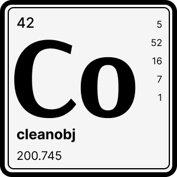

<br />
<div align="center">
  
  <h1 align="center">cleanobj</h3>
  <p align="center">Tiny (505B) removal of object properties that are undefined, functions, empty arrays or empty strings.</p>
  <p align="center">
    
    
  	 <a href="https://codeclimate.com/github/tuplo/cleanobj/test_coverage">
  	   </a>
  	 
  </p>
</div>

## Install

```bash
$ npm install @tuplo/cleanobj

# or with yarn
$ yarn add @tuplo/cleanobj
```

## Usage

```typescript
import clean from '@tuplo/cleanobj';

const obj = {
  p1: ' ',
  p2: ['', '', '', ['']],
  p3: ' four ',
  descriptions: ['SAMPLE SET', '', '', { foo: '', bar: null }],
  badNews: [null, '', '', 'SAMPLE'],
  p5: ['f ', ' ', ' do'],
  p6: { thing: 'one', zap: null, un: undefined },
  func: (foo) => foo,
  width: '',
  height: 0,
  finish: false,
  start: true,
  'alice.bob@charlie.com': 'Dean Edward',
};

const after = clean(obj);
// {
//   p3: 'four',
//   descriptions: [ 'SAMPLE SET', { bar: null } ],
//   badNews: [ null, 'SAMPLE' ],
//   p5: [ 'f', 'do' ],
//   p6: { thing: 'one', zap: null },
//   height: 0,
//   finish: false,
//   start: true,
//   'alice.bob@charlie.com': 'Dean Edward',
// }
```

## Options

### `ignore`

> (key: string, value: unknown) => boolean

A function that if it returns true for a given property, `cleanobj` will not clean that property.

```typescript
const obj = {
  p1: undefined,
  p2: [],
  p3: undefined,
};

function ignore(key: string, value: unknown) {
  return key === 'p1' || (value as unknown[]).length === 0;
}

const result = clean(obj, { ignore });
// {
//   p1: undefined,
//   p2: []
// }
```

## License

MIT
